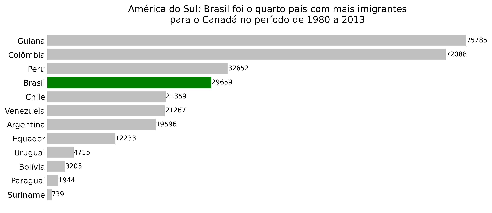
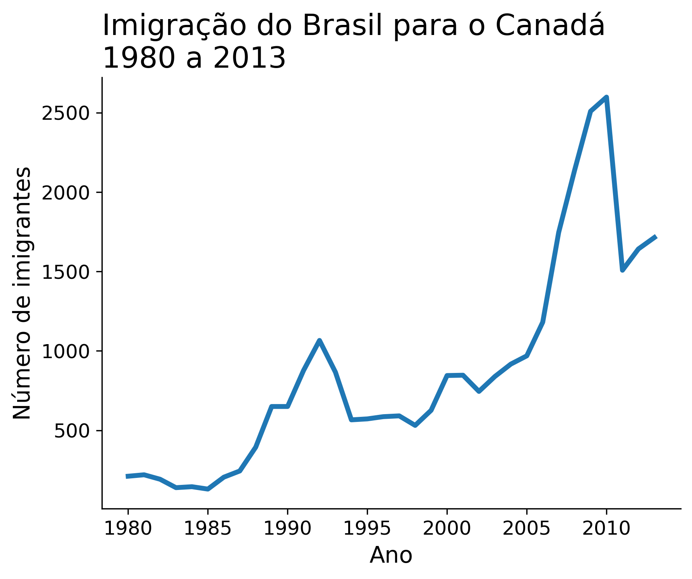

# 📊 Análise de Imigrantes Brasileiros no Canadá

Este projeto tem como objetivo analisar o perfil e a evolução dos imigrantes brasileiros no Canadá ao longo dos anos, utilizando técnicas de análise exploratória de dados com Python.

Além da análise em si, este projeto foi desenvolvido com foco no aprendizado prático de **Git e GitHub**, incluindo versionamento, commits e organização de repositórios.

---

## 🎯 Objetivo do Projeto

- Praticar análise de dados com Python  
- Aprender e aplicar conceitos de **Git** (commits, branches, versionamento)  
- Utilizar o **GitHub** para hospedar e organizar projetos  
- Melhorar a documentação com um README estruturado  

---

## 🧠 Contexto

Este projeto foi inicialmente baseado em um modelo existente e posteriormente **adaptado e modificado por mim**, com melhorias na análise, visualizações e organização do código.

Durante esse processo, foram aplicadas boas práticas de versionamento utilizando Git e GitHub.

---

## 📈 Análises Realizadas

A análise foi conduzida no Jupyter Notebook [`analise_de_imigrantes_brasileiros.ipynb`](analise_de_imigrantes_brasileiros.ipynb).


Principais explorações:

- Evolução da imigração brasileira ao longo dos anos  
- Comparação com outros países da América do Sul  
- Identificação de padrões e tendências migratórias  
- Criação de gráficos para visualização dos dados  

---

## 🗂️ Base de Dados

A base utilizada está no arquivo:

📄 `imigrantes_canada.csv`

Contém informações como:
- País de origem  
- Ano  
- Quantidade de imigrantes  

---

## 🛠️ Tecnologias Utilizadas

As principais bibliotecas utilizadas, listadas em [`requirements.txt`](requirements.txt), são:

1. **[pandas](https://pandas.pydata.org/)** - Manipulação e análise de dados.
2. **[numpy](https://numpy.org/)** - Operações numéricas e vetoriais.
3. **[matplotlib](https://matplotlib.org/)** - Visualização de dados.
4. **[seaborn](https://seaborn.pydata.org/)** - Visualização estatística de dados.
5. **[jupyter](https://jupyter.org/)** - Ambiente interativo para notebooks. 

---

## 📊 Visualizações

### 🌎 Imigração na América do Sul


### Evolução da Imigração Brasileira



---

## ▶️ Como Executar o Projeto

1. Clone o repositório:
```bash
git clone https://github.com/seu-usuario/seu-repositorio.git